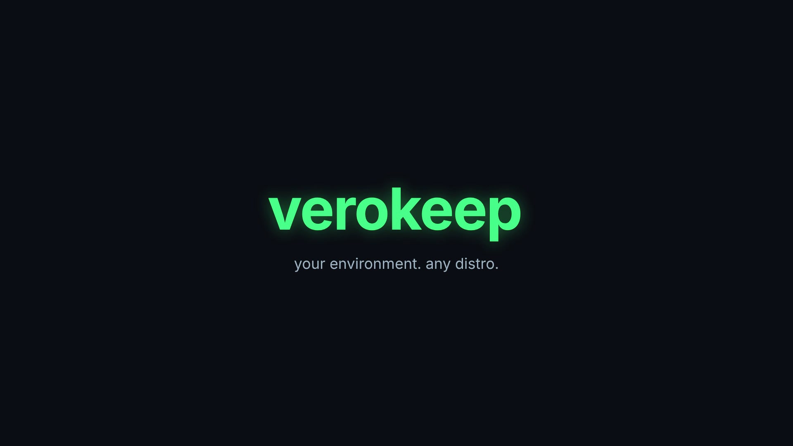

<p align="right">
  <a href="README.pt-BR.md">🇧🇷 Ler em português</a>
</p>

<h1 align="center">Verokeep</h1>

<p align="center">
  
</p>

<p align="center">
  Capture your Linux environment on one distro, recreate it on another — package names and all.
</p>

<p align="center">
  <a href="https://github.com/LucasLima73/verokeep/actions/workflows/ci.yml"></a>
  <a href="https://github.com/LucasLima73/verokeep/actions/workflows/release.yml"></a>
  
  
</p>

---

Open-source CLI, written in Java, that captures your user environment on one Linux distro — manually
installed packages, dotfiles, Flatpaks, repositories — and recreates it on another, translating package
names between `apt`, `dnf`, `pacman` and `zypper` along the way.

> **Status: MVP in progress**
> - ✅ Distro detector + `apt`/`pacman` collectors
> - ✅ `export` / `restore` (plan / dry-run)
> - ✅ Dotfiles collector with security exclusions
> - ✅ Package translator via `package-map.yaml`
> - ✅ Native binary (GraalVM) + CI + automated releases
> - ⏳ `restore` doesn't apply changes for real yet (plan/dry-run only)

## Demo

<p align="center">
  <video src="assets/demo.mp4" controls muted width="720" poster="assets/logo.jpg"></video>
</p>

> GitHub doesn't always render inline video from markdown right away — if you see a blank box above,
> grab the clip directly at [`assets/demo.mp4`](assets/demo.mp4).

## Why

If you distro-hop often, you know the pain: every fresh install means reconfiguring everything from
scratch. Tools like Ansible, chezmoi, Nix/home-manager, Timeshift and restic each solve part of the
problem, but they're heavy, have a steep learning curve, or simply don't translate package names across
distros. Verokeep is built around one goal: *I switched distros, I want my environment back in a few
minutes.*

## Usage

```bash
verokeep export -o my-environment.yaml           # on the old distro
verokeep restore my-environment.yaml --dry-run    # on the new distro, just show the plan
verokeep restore my-environment.yaml              # apply
verokeep restore my-environment.yaml --generate-script   # generate a script for review

verokeep backup --source ~/Projects --dest /mnt/backup/Projects          # dry-run (default)
verokeep backup --source ~/Projects --dest /mnt/backup/Projects --apply  # actually sync (optional, via rsync)
```

## Build

Requires Java 21 (a `.mise.toml` pins the version if you use [mise](https://mise.jdx.dev/)).

```bash
./gradlew build
./gradlew run --args="export -o environment.yaml"
```

### Native binary (GraalVM)

Requires a GraalVM distribution (e.g. via [mise](https://mise.jdx.dev/) or [sdkman](https://sdkman.io/))
as the active JDK:

```bash
./gradlew nativeCompile
./build/native/nativeCompile/verokeep export -o environment.yaml
```

Reflection/resource configuration for `native-image` (Jackson, `package-map.yaml`) lives in
`src/main/resources/META-INF/native-image/`. It hasn't been validated against a real native build yet —
if you hit a reflection error on some type, use GraalVM's
[tracing agent](https://www.graalvm.org/latest/reference-manual/native-image/metadata/AutomaticMetadataCollection/)
to regenerate/adjust those files.

### CI/CD

- `.github/workflows/ci.yml` — runs `./gradlew build` (compile + tests) on every push/PR to `main`.
- `.github/workflows/release.yml` — builds the native Linux binary via GraalVM and publishes it as a
  GitHub Release asset, triggered by pushing a `v*` tag:

  ```bash
  git tag v0.1.0
  git push origin v0.1.0
  ```

## Security

- Never exports `~/.ssh`, `~/.gnupg`, tokens or credentials by default.
- Never runs `sudo` behind your back.
- `--dry-run` is always available before any change is made.

## Related projects

No tool found solves exactly this problem (export/restore with package name translation across
distros), but several solve parts of it:

- [Aptik](https://github.com/teejee2008/aptik) and [apt-clone](https://github.com/mvo5/apt-clone) —
  package backup/restore, but only within the same distro, with no name translation.
- [chezmoi](https://github.com/twpayne/chezmoi) and [yadm](https://github.com/TheLocehiliosan/yadm) —
  multi-machine dotfile management; a reference for Verokeep's dotfiles collector.
- [Nix / home-manager](https://github.com/nix-community/home-manager) — full declarative environment
  management; the heavier "ideal" Verokeep is trying to avoid.
- [Timeshift](https://github.com/teejee2008/timeshift) — snapshots/rollback on the same machine, not
  cross-distro migration.
- [winget export/import](https://learn.microsoft.com/windows/package-manager/winget/export) (Windows) —
  UX reference for the `export`/`restore` pair.
- [Repology](https://repology.org) — cross-distro package catalog; planned fallback source for
  `package-map.yaml` (API rate-limited to 1 req/s, or full dumps at dumps.repology.org for offline use).

## License

To be defined.

## Contributing

Issues and PRs are welcome — especially additions to `src/main/resources/package-map.yaml` for packages
whose names differ between distros. Commits follow [Conventional Commits](https://www.conventionalcommits.org/).
